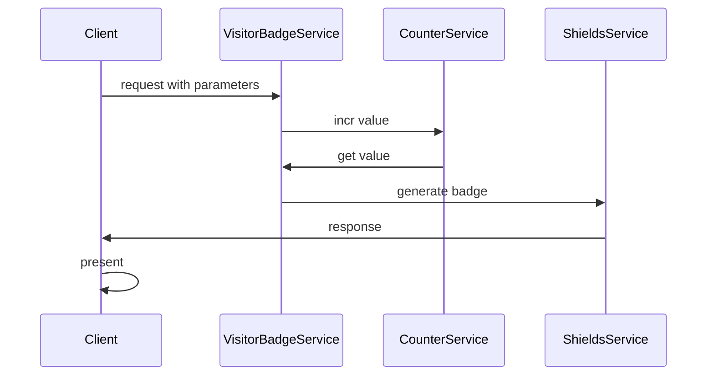

# visitor-badge

#### 0. Simple description

A service about badge generator to count visitors of your site (based on [counter-service](https://github.com/plantree/counter) and [shields.io](https://shields.io/)).

#### 1. How to use

##### 1.1 register a namespace in counter-service to help manage your data

There is a simple management panel here: [management-panel](https://plantree.github.io/project-docs/counter/usage.html#_1-management-panel).

##### 1.2 request visitor-badge 

###### 1.2.1 query parameters(almost the same with counter-service and shields.io)

| parameter   | value                                         |
| ----------- | --------------------------------------------- |
| ?namespace  | usually a domain name, like: plantree.me      |
| ?key        | usually a relative URL path, like: about.html |
| ?label      | left text in the badge, default: visitors     |
| ?labelColor | left color in the badge                       |
| ?color      | right color in the badge                      |
| ?style      | just like styles in shields.io                |

Styles examples:

`?style=plastic&logo=appveyor`

`?style=flat&logo=appveyor`

`?style=flat-square&logo=appveyor`

`?style=for-the-badge&logo=appveyor`

`?style=social&logo=appveyor`

###### 1.2.2 different ways of using

- The default badge:

  `http://127.0.0.1:5000/visitor-badge/pv?namespace=example.com&key=index.html`

  

- Change a style:

  ``

  

- Change colors:

- 

#### 2. Why do this

I am running a personal website, which is [plantree.me](https://microsoft.visualstudio.com/Edge/_queries/query-edit/d597e0bd-5759-492f-8aeb-47ccc8f65d02/), and I need a way to count the number of visitors.

Currently, there are some ready-made service to do this, just like: [visitor-badge](https://github.com/jwenjian/visitor-badge), [HITS](https://github.com/gjbae1212/hit-counter), etc. However, like I have post in [counter](https://github.com/plantree/counter#2-counter-vs-countapi-vs-visitor-badgehit-counter), there is no clear decoupling of presentation service and data service. That's why I develop **two separate services**:

- [data service](https://github.com/plantree/counter)
- presentation service(this)

You can use them **independently** and they all have **clear documentations and interfaces** for ease of use.

#### 3. Technology inside

##### 3.1 stack

| Component           | Implementation              |
| ------------------- | --------------------------- |
| runtime             | Vercel Serverless           |
| dependency services | counter-service & shieds.io |

##### 3.2 process

#### 4. Changelogs

#### 5. Reference

1. https://github.com/jwenjian/visitor-badge#readme
2. https://github.com/dwyl/hits
3. https://vercel.com/docs/concepts/functions/serverless-functions/runtimes/python
4. https://github.com/vercel/examples/tree/main/python/flask
5. https://shields.io/
